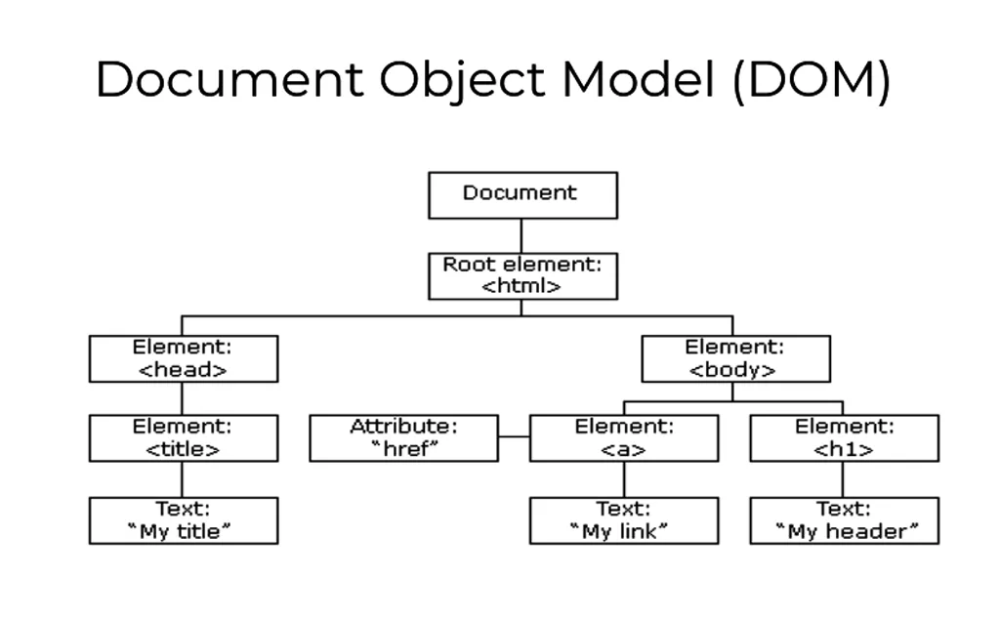

# What is BOM in JavaScript?
### > The Browser Object Model (BOM) allows JavaScript to "talk to" the browser
### > The Browser Object Model (BOM) is the additional objects provided by the browser (environment) to work with everything other than the document.

# What is DOM in JavaScript ?
### DOM - "Document Object Model". It's a standardized way of representing the structure of a document (such as HTML) as a tree-like structure, where each node represents a part of the document, such as an element, attribute, text content, etc.

###  DOM allows programs and scripts to access, manipulate, and update the content, structure, and styles of a web page. JavaScript is commonly used to interact with the DOM in web development, for tasks such as dynamically changing the content of a page or handling user events.

# Dom Features
### According to the Document Object Model (DOM for short), every HTML tag is an object. Subtags are "children" of the parent element.

### . The text that is inside the tag is also an object.All these objects are available with JavaScript, we can use them to modify the page

# HTML DOM Element innerHTML,style object
### innerHTML - this property completely provides an easy way replace the elementary element. For example, all requirements the element's body can be removed:

### The Style object represents an individual style statement.

# Dom Events
### HTML events are "things" that happen to HTML elements. When JavaScript is used in HTML pages, JavaScript can "react" on these events.
### An HTML event can be something the browser does, or something a user does.

## Here are some examples of HTML events:
 + An HTML web page has finished loading
 - An HTML input field was changed
 * An HTML button was clicked

### JavaScript lets you execute code when events are detected.
### onclick -The user clicks an HTML element

# Dom Create element
### Dom Create element The JavaScript document.createElement() method allows you to create and return a new element (an empty Element node) with the specified tag name.
### 1) createElement(elementName): Creates an html element whose tag is passed as a parameter. Returns the created elemen

# Dom props: classList
### Dom props: classList Element.classList is a read-only property that contains the current DOMTokenList collection of all the element's class attributes.
### Using classList provides a more convenient way than accessing an element's class list as a spaceseparated string via element.className.

